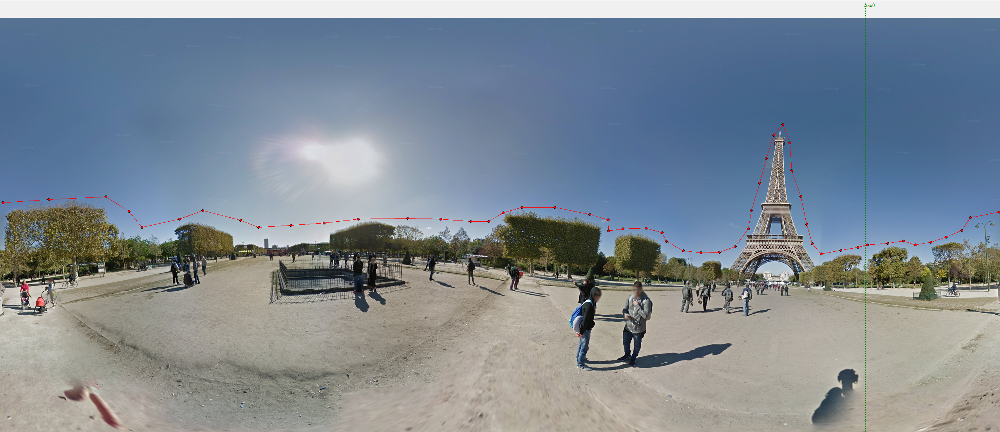

# Horizon Maker
This script allows you to generate HRZ horizon files for NINA, Stellarium and other software from an equirectangular panoramic image. Assuming that the image is 360 degress wide and 180 degrees high, and that the middle part of the image is aligned with the horizon, this script allows the user to mark where Az 0 is and generate points following the horizon, which will then be converted to Az/Alt degree coordinates.

## How to use
1. Open your image with the File menu. The image must be an equirectangular panorama.
2. Mark Az 0 by right-clicking any part of the image. A vertical line will appear. All azimith coordinates will be calculated relative to this line.
3. From left to  right, left-click on the image to generate points following the horizon. Each point will be an Az/Alt coordinate.
4. Using the File menu, save your HRZ file.

## Considerations
* This script assumes that the middle part of the image (height / 2) aligns with the horizon and has elevation 0. Tilted panoramas will not work, as they'll yield incorrect altitude values.
* There's, as of now, no option to undo or modify points. You need to do it right in one go.
* The resulting HRZ files have only been tested in Stellarium and Nina.
* The HRZ file needs to start with Az 0, so the first point you click to the right of the vertical line will be translated to Az=0. I'd suggest that your first click to the right of Az is as close to the line as possible.